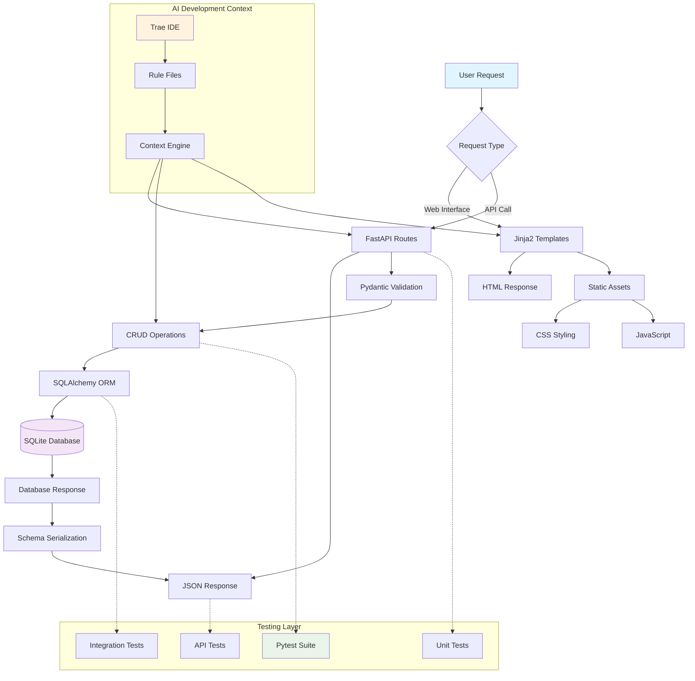

# SaveMyLinks

**AI For Developers II Capstone Project | [ALX](https://www.alxafrica.com/)**

## 🔖 Project Description

**SaveMyLinks** is a full-stack web application designed to curate and share valuable online resources. It addresses information overload by offering a clean, organized, and visually appealing dashboard for storing, searching, and discovering useful links across the internet. This project serves as a capstone for the ALX AI For Developers II course, demonstrating practical integration of AI tools throughout the development lifecycle.

---

## ✨ Features Implemented

### 🔧 Core Functionality
- **Resource Management**: Full CRUD operations for bookmarks/links
- **Search & Filter**: Real-time search across titles and descriptions
- **Category Organization**: Organize resources by categories with visual tags
- **URL Validation**: Automatic URL normalization and validation
- **Responsive Design**: Mobile-first responsive web interface

### 🌐 Web Interface
- **Home Dashboard**: Clean listing of all saved resources with pagination
- **Add Resource Form**: Interactive form with client-side validation
- **Search Interface**: Real-time search with category filtering
- **Category Tags**: Color-coded category system for easy organization

### 🚀 API Endpoints
- `GET /api/resources` - List resources with pagination & filtering
- `POST /api/resources` - Create new resource
- `GET /api/resources/{id}` - Get specific resource
- `PUT /api/resources/{id}` - Update resource
- `DELETE /api/resources/{id}` - Delete resource
- `GET /api/categories` - List all available categories

### 🧪 Quality Assurance
- **Comprehensive Testing**: 45 automated tests covering all functionality
- **Error Handling**: Proper HTTP status codes and user-friendly error messages
- **Data Validation**: Pydantic schemas for robust data validation
- **Code Quality**: Type hints, async/await patterns, and clean architecture

---

## 🛠️ Technologies Used

### Backend Stack
- **FastAPI**: Modern, fast web framework for building APIs
- **SQLAlchemy**: SQL toolkit and Object-Relational Mapping (ORM)
- **SQLite**: Lightweight database for development
- **Pydantic**: Data validation using Python type annotations
- **Uvicorn**: Lightning-fast ASGI server

### Frontend Stack
- **Jinja2**: Modern templating engine for Python
- **Bulma CSS**: Modern CSS framework based on Flexbox
- **Font Awesome**: Icon toolkit for enhanced UI
- **Vanilla JavaScript**: Client-side interactivity and form validation

### Development & Testing
- **Pytest**: Testing framework with fixtures and async support
- **AsyncClient**: FastAPI test client for API testing
- **Git**: Version control system
- **Python 3.9+**: Programming language

---

## 📁 Project Structure

```
savemylinks/
├── app/                    # Main application package (equivalent to /src)
│   ├── __init__.py        # Package initialization
│   ├── main.py            # FastAPI application entry point
│   ├── models.py          # SQLAlchemy database models
│   ├── schemas.py         # Pydantic validation schemas
│   ├── database.py        # Database configuration and setup
│   ├── crud.py            # Database CRUD operations
│   ├── routes/            # API route handlers (equivalent to /api)
│   │   ├── __init__.py
│   │   └── resources.py   # Resource management endpoints
│   ├── static/            # Static assets
│   │   └── style.css      # Custom CSS styling
│   ├── templates/         # Frontend components
│   │   ├── base.html      # Base template with common layout
│   │   ├── index.html     # Home page template
│   │   └── add.html       # Add resource form template
│   └── tests/             # Comprehensive test suite
│       ├── __init__.py
│       ├── conftest.py    # Pytest configuration and fixtures
│       ├── test_crud.py   # Database operation tests
│       ├── test_models.py # Model validation tests
│       └── test_routes.py # API endpoint tests
├── .trae/                 # Documentation and guidelines (equivalent to /docs)
│   └── rules/
│       ├── architecture.md     # Architecture guidelines
│       ├── development.md      # Development standards
│       ├── orchestration.md    # Project orchestration
│       └── design_philosophy.md # Design principles
├── .gitignore             # Git ignore patterns
├── conftest.py            # Root pytest configuration
├── pytest.ini            # Pytest settings
├── requirements.txt       # Python dependencies
└── README.md              # Project documentation
```

---

## 🚀 Setup and Run Instructions

### Prerequisites
- **Python 3.9+** installed on your system
- **pip** package manager
- **Git** for version control (optional)

### Installation Steps

1. **Clone the repository** (or download the source code):
   ```bash
   git clone https://github.com/joethesaint/savemylinks.git
   cd savemylinks
   ```

2. **Create a virtual environment** (recommended):
   ```bash
   python -m venv venv
   
   # On Windows
   venv\Scripts\activate
   
   # On macOS/Linux
   source venv/bin/activate
   ```

3. **Install dependencies**:
   ```bash
   pip install -r requirements.txt
   ```

4. **Run the application**:
   ```bash
   python -m uvicorn app.main:app --reload --host 0.0.0.0 --port 8000
   ```
   
   ⚠️ **Security Warning**: The `--host 0.0.0.0` flag exposes the application on all network interfaces, making it accessible from any device on your network. This is **NOT recommended for production use**.
   
   **For production deployment**:
   - Use `--host 127.0.0.1` to bind only to localhost
   - Deploy behind a proper production server (e.g., Gunicorn, uWSGI) with a reverse proxy (Nginx, Apache)
   - Configure firewall rules and allowed hosts appropriately
   - Use environment-specific configuration files for different deployment environments

5. **Access the application**:
   - **Web Interface**: Open your browser and navigate to `http://localhost:8000`
   - **API Documentation**: Visit `http://localhost:8000/docs` for interactive API docs
   - **Alternative API Docs**: Visit `http://localhost:8000/redoc` for ReDoc documentation

### Running Tests

Execute the comprehensive test suite:
```bash
# Run all tests
python -m pytest

# Run with verbose output
python -m pytest -v

# Run specific test file
python -m pytest app/tests/test_routes.py

# Run with coverage report
python -m pytest --cov=app
```

### Development Mode

For development with hot reload:
```bash
python -m uvicorn app.main:app --reload --host 0.0.0.0 --port 8000
```

---

## 🧠 Notes on AI Usage

This project extensively leveraged AI tools throughout the development lifecycle, demonstrating modern AI-assisted development practices:

### 🤖 AI Tools and Contexts Used

#### 1. **Trae IDE - Primary Development Assistant**
- **Code Generation**: Generated foundational FastAPI application structure, SQLAlchemy models, and Pydantic schemas
- **API Development**: Created RESTful endpoints with proper error handling and validation
- **Database Operations**: Implemented CRUD operations with async/await patterns
- **Frontend Development**: Built responsive HTML templates and CSS styling
- **Bug Fixing**: Resolved deprecation warnings, styling issues, and test failures

#### 2. **Context-Aware Development**
- **Rule-Based Context**: Used `.trae/rules/` directory to provide AI with project-specific conventions:
  - `architecture.md`: System architecture guidelines
  - `development.md`: Coding standards and best practices
  - `design_philosophy.md`: UI/UX design principles
  - `orchestration.md`: Project workflow and deployment strategies

#### 3. **Testing and Quality Assurance**
- **Test Generation**: AI created comprehensive test suite covering:
  - Unit tests for models and CRUD operations
  - Integration tests for API endpoints
  - Web interface testing
  - Edge case validation
- **Test Debugging**: Fixed AsyncClient configuration and endpoint testing issues
- **Code Quality**: Implemented proper error handling, type hints, and documentation

#### 4. **Problem-Solving Approach**
- **Iterative Development**: Used AI for incremental feature development and debugging
- **Code Review**: AI identified and fixed deprecation warnings and styling issues
- **Documentation**: Generated comprehensive README and inline code documentation
- **Architecture Decisions**: AI provided guidance on FastAPI best practices and project structure

### 🎯 AI Development Workflow

The development process followed an AI-assisted approach:

1. **Planning**: AI helped structure the project architecture and technology stack
2. **Implementation**: Generated code based on high-level requirements and specifications
3. **Testing**: Created comprehensive test coverage with AI assistance
4. **Debugging**: Used AI to identify and resolve issues in real-time
5. **Optimization**: Improved code quality, performance, and user experience
6. **Documentation**: Maintained up-to-date documentation throughout development

### 💡 Key AI Contributions

- **45 Automated Tests**: Comprehensive test suite ensuring code reliability
- **Clean Architecture**: Well-organized codebase following FastAPI best practices
- **Responsive Design**: Modern, mobile-first web interface
- **Error Handling**: Robust validation and user-friendly error messages
- **Performance**: Async/await patterns for optimal performance
- **Code Quality**: Type hints, proper documentation, and maintainable code structure

---

## 🔄 Project Workflow Diagram



---

## 📌 Future Enhancements

- **User Authentication**: Implement user accounts and private collections
- **Advanced Filtering**: Tags system and multi-criteria filtering
- **Link Previews**: Automatic generation of link preview images and metadata
- **Export/Import**: Backup and restore functionality
- **Public API**: Rate-limited public API for third-party integrations
- **Analytics**: Usage statistics and popular resources tracking
- **Social Features**: Resource sharing and collaborative collections

---

## 🤝 Contributing

This project was developed as part of the **AI For Developers II** course offered by [ALX](https://www.alxafrica.com/), focusing on real-world AI-assisted development practices. The codebase demonstrates modern Python web development with comprehensive AI integration throughout the development lifecycle.

---

## 📄 License

This project is part of the ALX AI For Developers II capstone program and is intended for educational purposes.